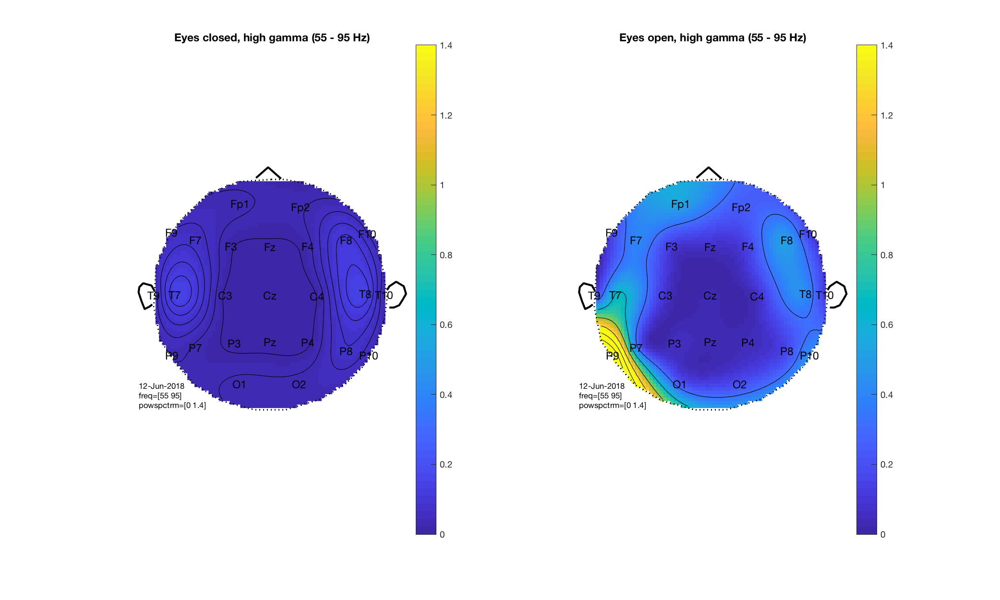

# Results

## Pipeline

1. Visually inspect filtered (0.1 Hz highpass) for obvious bad channels
2. ICA decomposition:
    1. Highpass filter (1 Hz)
    2. epoch into dummy consecutive epochs (length 2sec)
    3. Remove bad channels from visual inspection
    4. get rid of non-stereotypical artifacts (z-value, threshold 20)
    5. train runica (no dimensionality reduction)
    6. read in the raw data again
    7. apply the ica weights to the unprocessed raw data
3. filter:
    1. Highpass: 0.1 Hz, 4530-order FIR
    2. Lowpass: 40 Hz, 60-order FIR
4. Automatic artifact rejection:
    1. SQUID electrode jumps: Z-score (threshold 20)
    2. Thresholding +/- 400µv

## EOG artifact removal

Very clear eyeblinks, especially in Fp1 and Fp2
(Subject: s1001, Highpass filtered 0.1 Hz with ~4530-order FIR)

After ICA reconstruction

## Re-referencing

Changes ERP dramatically:

No re-referencing:

With average re-referencing:

## ERP Analysis

### Grand average by subject

### Controls

#### s1005 (CONTROL)

#### s1008 (CONTROL)

#### s1021 (CONTROL)

#### s1022 (CONTROL)

### Patients

#### s1001 (PATIENT)

#### s1003 (PATIENT)

#### s1004 (PATIENT)

#### s1006 (PATIENT)

#### s1007 (PATIENT)

#### s1009 (PATIENT)

#### s1010 (PATIENT)

#### s1011 (PATIENT)

#### s1012 (PATIENT)

#### s1013 (PATIENT)

#### s1014 (PATIENT)

#### s1015 (PATIENT)

#### s1016 (PATIENT)

#### s1017 (PATIENT)

#### s1018 (PATIENT)

#### s1019 (PATIENT)

#### s1020 (PATIENT)

#### s1023 (PATIENT)

#### s1024 (PATIENT)

## Frequency

### Full spectrum (PATIENT)

### Full spectrum (CONTROL)

### Patient

#### delta (PATIENT)

#### theta (PATIENT)

#### alpha (PATIENT)

#### low gamma (PATIENT)

#### high_gamma (PATIENT)

### Control

#### delta (CONTROL)

#### theta (CONTROL)

#### alpha (CONTROL)

#### low gamma (CONTROL)

#### high_gamma (CONTROL)

